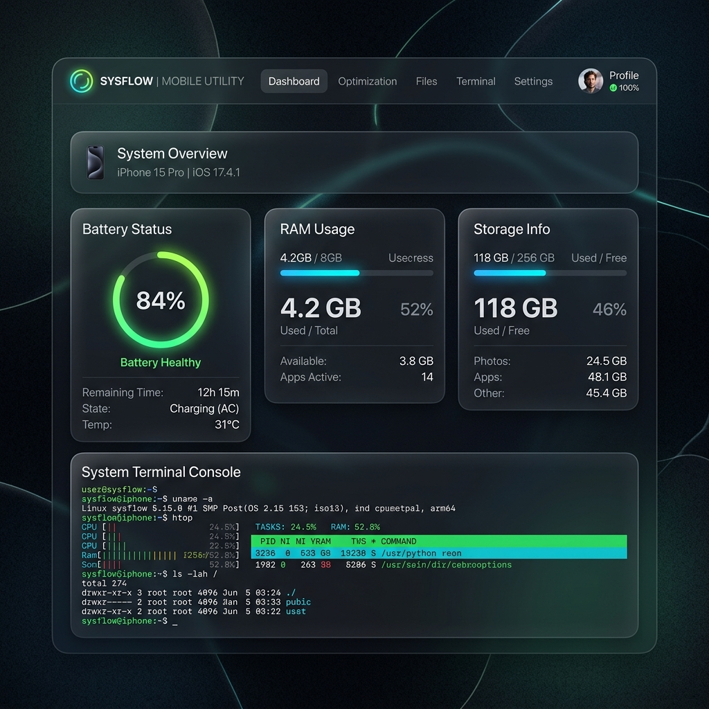

# Termux System Dashboard & Remote Console

Aplikasi web dashboard untuk Termux Android menggunakan Go. Aplikasi ini berfungsi menampilkan metrik perangkat, mengelola file, mengeksekusi perintah diagnostik cepat, dan menyediakan akses terminal remote terenkripsi SSL/TLS.



---

## Fitur Utama

1. **Dashboard Metrik & Grafik Realtime**: Menampilkan status baterai, penggunaan RAM, sisa penyimpanan, penggunaan CPU (%), spesifikasi CPU/HP, uptime, serta grafik performa realtime yang interaktif (menggunakan Chart.js).
2. **Editor Teks Terintegrasi (Built-in Text Editor)**: Mengedit dan menyimpan file teks (seperti konfigurasi, skrip, log) secara langsung dari peramban tanpa perlu proses unduh-unggah ulang.
3. **Manajer Proses Interaktif (Process Manager)**: Memantau daftar proses aktif yang berjalan di Termux (PID, CPU, Memori) lengkap dengan tombol *Kill Process* sekali klik.
4. **Keamanan Ekstra (Bcrypt Hashing)**: Melindungi otentikasi login Basic Auth dengan hashing sandi berbasis **Bcrypt** untuk mencegah kebocoran kredensial.
5. **Arsitektur Modular (Clean Code)**: Kode backend dipisah secara rapi berdasarkan domain fungsional (`main.go`, `handlers.go`, `metrics.go`, `security.go`, `terminal.go`, `process.go`, `cert.go`) untuk kemudahan pemeliharaan jangka panjang.
6. **Biner Tunggal (Single-Binary)**: Semua file statis frontend (HTML, CSS, JS) di-embed ke dalam biner Go menggunakan `go:embed`. Aplikasi dapat dijalankan langsung sebagai satu file executable.
7. **Koneksi HTTPS**: Menggunakan SSL/TLS secara default. Sertifikat `cert.pem` dan `key.pem` dibuat otomatis saat server pertama kali dijalankan.
8. **Autentikasi Basic**: Akses dashboard dilindungi oleh HTTP Basic Authentication.
9. **Terminal WebTTY**: Terminal remote interaktif menggunakan WebSockets dan `xterm.js` yang terhubung langsung ke shell PTY (`bash` atau `sh`). Mendukung penyesuaian ukuran terminal.
10. **Manajemen File (File Explorer)**: Navigasi direktori, unduh, hapus, dan unggah file (ukuran maksimal 50MB).
11. **Keamanan IP**: Filter akses menggunakan berkas konfigurasi `whitelist.txt` dan `blacklist.txt`.
12. **Konfirmasi Android Koneksi**: Menampilkan notifikasi dan dialog konfirmasi persetujuan di layar HP ketika ada percobaan koneksi baru dari IP eksternal.
13. **Log Koneksi**: Mencatat setiap aktivitas koneksi masuk ke dalam file `connections.log`.
14. **Android Wake Lock**: Otomatis mengaktifkan wake lock (`termux-wake-lock`) untuk mencegah CPU Android tidur saat server berjalan, sehingga koneksi background tetap stabil.

---

## Struktur Direktori

- `main.go` — Titik masuk server, penyiapan router, server HTTPS, dan pembersihan shutdown.
- `handlers.go` — Kumpulan handler API HTTP (metrik, file manager, proses, perintah cepat).
- `metrics.go` — Mengambil status baterai, memori, penyimpanan, uptime, dan CPU usage (via toybox top parser).
- `security.go` — Autentikasi Basic Auth (Bcrypt), logging IP, dan middleware whitelist/blacklist.
- `terminal.go` — Logika PTY WebTTY WebSocket.
- `process.go` — Logika manajer proses (membaca proses aktif dan menghentikannya).
- `cert.go` — Logika pembuatan sertifikat SSL *self-signed*.
- `public/index.html` — Frontend statis (HTML/CSS/JS/Chart.js).
- `dashboard` — Executable biner hasil kompilasi.

---

## Konfigurasi Keamanan

### 1. Kredensial Login
* **Username**: `admin` (Dapat diubah dengan mendefinisikan `DASHBOARD_USER`).
* **Password**: Secara default, jika *environment variable* `DASHBOARD_PASSWORD` tidak ditentukan, aplikasi akan **membuat password acak sekali pakai secara otomatis** pada saat startup dan mencetaknya ke konsol terminal Termux.

Untuk menetapkan kredensial secara manual, jalankan aplikasi dengan *environment variables* berikut:
```bash
DASHBOARD_USER=username_baru DASHBOARD_PASSWORD=password_baru ./dashboard
```

### 2. Sertifikat SSL
Biner akan membuat berkas `cert.pem` dan `key.pem` secara otomatis.
* Saat mengakses pertama kali via peramban (misalnya `https://localhost:8443`), peramban akan memunculkan peringatan sertifikat tidak dikenal (*self-signed*).
* Anda dapat melanjutkan akses secara aman (*proceed unsafe*) karena koneksi tetap terenkripsi.

### 3. Alur Verifikasi Koneksi
1. Verifikasi IP pada `blacklist.txt` dan `whitelist.txt`.
2. Verifikasi HTTP Basic Authentication.
3. Dialog konfirmasi Android (khusus koneksi dari luar localhost).

---

## API Reference

### Sistem & Metrik
* **`GET /api/stats`**: Mendapatkan metrik perangkat terbaru (baterai, RAM, penyimpanan, penggunaan CPU, spesifikasi hardware, dan interface jaringan) dalam format JSON.

### File Manager & Editor
* **`GET /api/files/list?path=<direktori>`**: Menampilkan daftar file dan folder (default ke direktori aktif `.`).
* **`GET /api/files/download?path=<file>`**: Mengunduh berkas.
* **`POST /api/files/upload?path=<direktori>`**: Mengunggah berkas ke direktori tujuan (batas ukuran 50MB).
* **`POST /api/files/delete`**: Menghapus berkas atau folder (Menerima JSON: `{"path": "<path_berkas>"}`).
* **`GET /api/files/view?path=<file>`**: Membaca isi file teks untuk editor teks built-in.
* **`POST /api/files/save`**: Menyimpan perubahan isi file teks (Menerima JSON: `{"path": "<file>", "content": "<isi_baru>"}`).

### Manajer Proses
* **`GET /api/processes`**: Mengambil daftar proses aktif yang sedang berjalan (PID, CPU, Memori, Command).
* **`POST /api/processes/kill`**: Menghentikan proses aktif berdasarkan PID (Menerima JSON: `{"pid": <PID>}`).

### Perintah Cepat (Device Diagnostics)
* **`POST /api/vibrate`**: Mengaktifkan getar ponsel (memerlukan `termux-api`).
* **`POST /api/tts`**: Mengucapkan teks lewat speaker (memerlukan `termux-api`, parameter JSON: `{"text": "<teks>"}`).
* **`POST /api/toast`**: Menampilkan notifikasi toast di layar HP (memerlukan `termux-api`, parameter JSON: `{"text": "<teks>"}`).

---

## Prasyarat & Kebutuhan Sistem

Sebelum menjalankan aplikasi, pastikan Anda telah menginstal utilitas berikut di lingkungan Termux Anda:
1. **Termux API**: Diperlukan untuk fitur getar, text-to-speech (TTS), dan notifikasi toast.
   * Instal paket CLI di Termux:
     ```bash
     pkg install termux-api
     ```
   * Instal aplikasi pendamping **Termux:API** di perangkat Android Anda (dapat diunduh via [F-Droid](https://f-droid.org/packages/com.termux.api/)).
2. **Go Compiler (Opsional)**: Hanya diperlukan jika Anda ingin memodifikasi kode sumber dan membangun ulang biner secara mandiri.
   ```bash
   pkg install golang
   ```

---

## Panduan Instalasi & Kompilasi

Jika Anda menduplikasi proyek ini atau ingin membangun biner executable sendiri dari kode sumber:

1. Clone repositori ini ke dalam direktori penyimpanan Termux Anda:
   ```bash
   git clone https://github.com/ghulam-akb/termux-dashboard.git
   cd termux-dashboard
   ```
2. Jalankan perintah kompilasi menggunakan Go (mengompilasi semua file modular):
   ```bash
   go build -o dashboard
   ```
   *Biner mandiri baru bernama `dashboard` akan dibuat di dalam direktori proyek.*

---

## Panduan Penggunaan

### Menjalankan Server (Foreground)
```bash
cd ~/termux-dashboard
./dashboard
```
Tekan `Ctrl + C` untuk menghentikan.

### Menjalankan di Latar Belakang (Background)
```bash
cd ~/termux-dashboard
nohup ./dashboard > /dev/null 2>&1 &
```

### Menghentikan Proses Server

```bash
pkill dashboard
```
